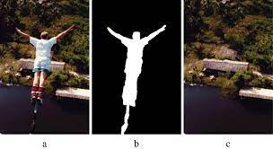
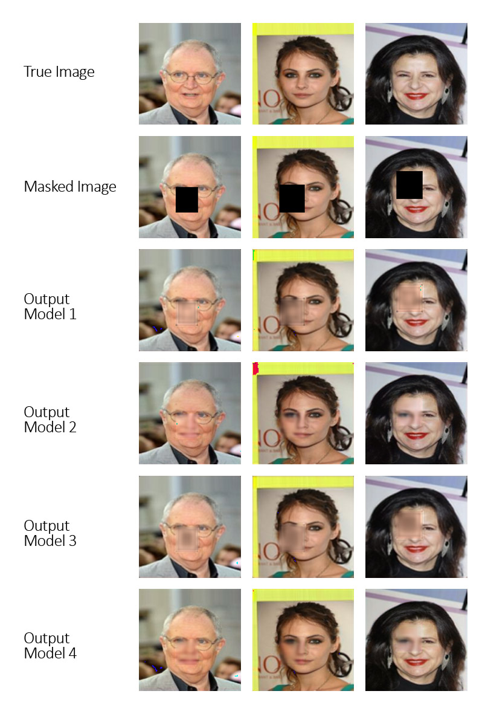

# Image Inpainting using CNN-based Autoencoders (CNN-GAN)

This repository presents an experimental study on **image inpainting using convolutional neural networks**, with a focus on how **input representations** and **loss function design** influence reconstruction quality in masked image regions. The work follows a research-oriented evaluation style commonly seen in computer vision literature.

The core model is based on a **U-Net autoencoder architecture**, trained on synthetically masked images and evaluated using standard image quality metrics.

## 1. Introduction

Image inpainting is the task of restoring missing or corrupted regions of an image in a visually coherent manner. It is widely used in applications such as object removal, image restoration, scene completion, and perception systems.

In this project, we investigate CNN-based generative inpainting models trained using masked images. The goal is to reconstruct missing regions while preserving semantic consistency and minimizing distortion in unmasked areas.

  

  <em>Figure 1: Sample qualitative result showing the reconstructed region produced by the proposed image inpainting model.</em>

## 3. Methodology

### 3.1 Input Representation

Each training sample consists of:
- A masked RGB image
- The corresponding ground-truth image

Two input strategies are explored:

- **3-Channel Input**  
  The masked RGB image, where pixels inside the mask are set to zero.

- **4-Channel Input**  
  The masked RGB image concatenated with the binary mask as an additional input channel.

### 3.2 Network Architecture

The model is based on a **U-Net encoder–decoder architecture** with skip connections. This design allows the network to capture global context while preserving fine-grained spatial details necessary for pixel-level reconstruction.

Key characteristics:
- Fully convolutional architecture
- Encoder–decoder symmetry
- Skip connections for spatial feature preservation

---

### 3.3 Loss Functions

Two loss formulations were evaluated:

#### (a) Mean Squared Error (MSE)
A standard pixel-wise L2 loss applied over the full image.

#### (b) Mask-Aware Composite Loss
A weighted combination of:
- MSE inside the masked region
- MSE outside the masked region
- PSNR-based loss term

This formulation prioritizes accurate reconstruction in missing regions while limiting unnecessary changes elsewhere.

## 4. Experimental Setup

### 4.1 Datasets

Experiments were conducted progressively on datasets of increasing complexity:

- Low-resolution face images
- High-resolution face images
- Street and landscape images (Cityscapes-style)

Random rectangular masks were generated dynamically during training.

---

### 4.2 Models Evaluated

| Model | Input Type | Loss Function |
|------|-----------|---------------|
| Model 1 | RGB (3-channel) | MSE |
| Model 2 | RGB (3-channel) | Composite Loss |
| Model 3 | RGB + Mask (4-channel) | MSE |
| Model 4 | RGB + Mask (4-channel) | Composite Loss |

---

## 5. Evaluation Metrics

The following metrics were used for evaluation:

- **Mean Squared Error (MSE)**
- **Peak Signal-to-Noise Ratio (PSNR)**
- **Structural Similarity Index (SSIM)**

Metrics were computed:
- Over the full image
- Inside masked regions

## 6. Quantitative Results

| Metric | Image Region | Model 1 | Model 2 | Model 3 | Model 4 |
|------|-------------|--------|--------|--------|--------|
| PSNR | All | 77.69 | 76.65 | 76.85 | **78.85** |
| PSNR | Inside Mask | 78.46 | **82.89** | 77.52 | 82.68 |
| SSIM | All | 0.960 | 0.969 | 0.961 | **0.977** |
| SSIM | Inside Mask | 0.978 | **0.989** | 0.976 | 0.988 |
| MSE | Inside Mask | 0.00112 | 0.00042 | 0.00137 | **0.00044** |

## 7. Sample results

  

  <em>Figure 1: Sample model inferencing results of all 4 models.</em>

## 8. Project Report (PDF)

The complete technical report describing the methodology, experiments, and analysis is available here:

📄 **[Project Report (PDF)](Image_impainting_Report.pdf)**

Place the final report inside the `report/` directory.

## 9. Limitations and Future Work

- Support for irregular and free-form masks
- Improved boundary blending
- Partial and gated convolution architectures
- Training on higher-resolution images
- Improved perceptual loss formulations

